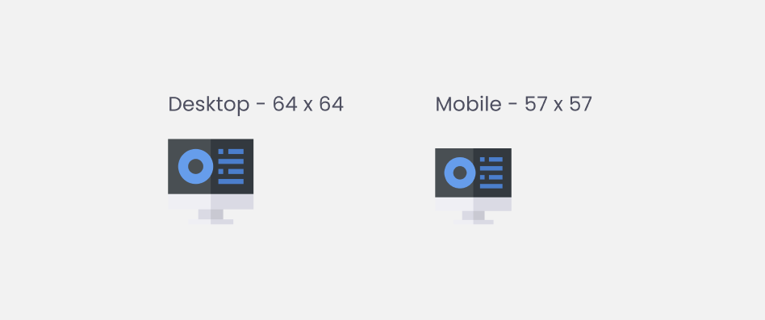
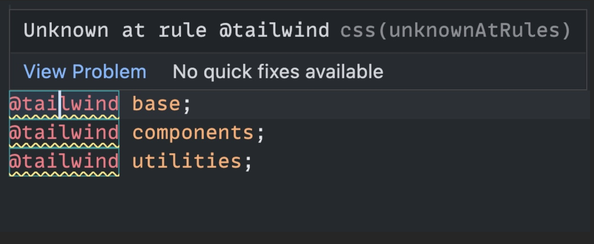

# Frontend Mentor - Four card feature section solution

This is a solution to the [Four card feature section challenge on Frontend Mentor](https://www.frontendmentor.io/challenges/four-card-feature-section-weK1eFYK). Frontend Mentor challenges help you improve your coding skills by building realistic projects.

## Table of contents

- [Overview](#overview)
  - [The challenge](#the-challenge)
  - [Screenshot](#screenshot)
  - [Links](#links)
- [My process](#my-process)
  - [Built with](#built-with)
  - [What I learned](#what-i-learned)
  - [Continued development](#continued-development)
  - [Useful resources](#useful-resources)
- [Author](#author)

### The challenge

Users should be able to:

- View the optimal layout for the site depending on their device's screen size

### Screenshot


### Links

- Solution URL: [Add solution URL here](https://your-solution-url.com)
- Live Site URL: [Four Card Feature](https://fourcardfeaturefementor.netlify.app/)

## My process

- Download starter and design files
- Read through READMEs and orient myself with the project
- Copy README template file and clean up. Begin documenting relevent sections
- Copy images files to begin importing process screenshots
- Analyze design files and note design blocks (containers)
  
- Analyze design files and note margins and paddings
  
- Analyze design files and note font faces, weights, sizes, leading, and tracking
  
- Analyze design files and note colors
  
- Analyze design files and note images sizes
  
- Initialize Git and GitHub
- Copy starter files
- Clean up index.html
- Set up [Tailwind CSS](https://tailwindcss.com/)
- Set up semantic HTML tags
- Set up font configuration in Tailwind
- Apply font classes to elements
- Refactor font sizes, tracking, and leading to em from px
- Set up color configuration in Tailwind
- Apply color classes to elements
- Apply layout (Grid, Flex)
- Apply margins and paddings
- Deploy
- TODO: Check for zoom accessibility
- TODO: Check for screen reader accessibility
- TODO: Refactor and fine tune

### Built with

- Semantic HTML5 markup
- Tailwind CSS
- CSS custom properties
- Flexbox
- Mobile-first workflow

### What I learned

- How to set up prettier for tailwind

1. Install `prettier-plugin-tailwindcss` as a dev-dependency

```sh
npm install -D prettier prettier-plugin-tailwindcss
```

2. Create a `prettier.config.js` file then add the plugin and include your Tailwind configuration file path

```js
// prettier.config.js
module.exports = {
  plugins: ["prettier-plugin-tailwindcss"],
  tailwindConfig: "./tailwind.config.js",
};
```

- If you need more customization, [go here](https://github.com/tailwindlabs/prettier-plugin-tailwindcss/blob/main/README.md)

- I learned how to fix Unknown at rule @tailwindcss (unknownAtRules) in VS Code using [this site](https://flaviocopes.com/fix-unknown-at-rule-tailwind/)



> Open a CSS file in your project, and from the VS Code Command Palette choose “Change Language Mode”, then pick “Tailwind CSS” from the list.

### Continued development

Definitely more Tailwind deep-diving!

### Useful resources

- [Tailwind Documentation](https://tailwindcss.com/docs/installation)
- [Prettier Plugin Tailwind](https://github.com/tailwindlabs/prettier-plugin-tailwindcss/blob/main/README.md)

## Author

- Website - [Steve Xero](https://www.stevexero.com) - under construction
- Old [Website](https://www.steven-woodward.com)
- GitHub - [Steve Xero](https://www.github.com/stevexero)
- Frontend Mentor - [@stevexero](https://www.frontendmentor.io/profile/stevexero)
- X - [@steve_xero](https://www.twitter.com/steve_xero)

## Inspirational Quote for when you need a pick-me-up

- [It does not matter how slowly you go as long as you do not stop](https://medium.com/@officialprpatel002/it-does-not-matter-how-slowly-you-go-as-long-as-you-do-not-stop-confucius-77e3030ed326)
- [Confucius](https://www.britannica.com/biography/Confucius)
